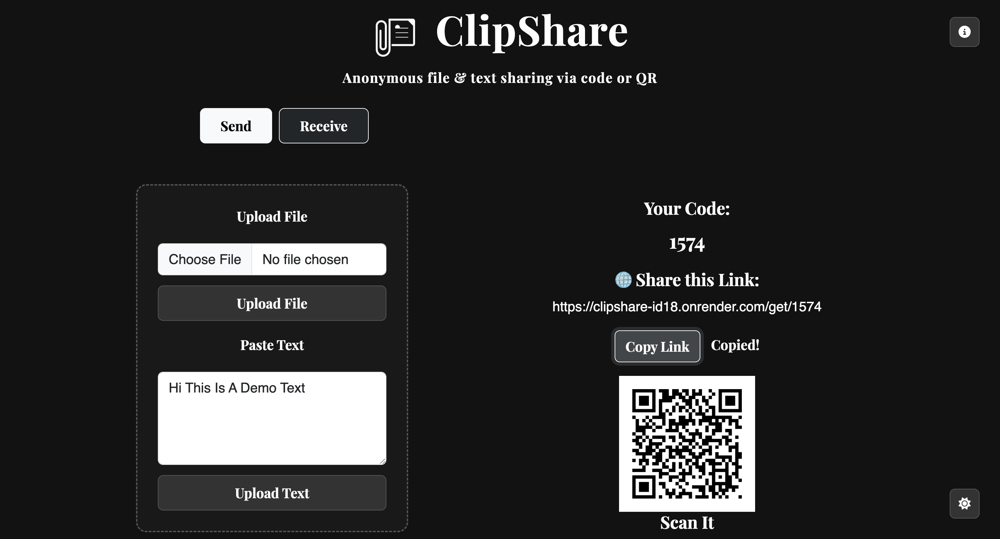
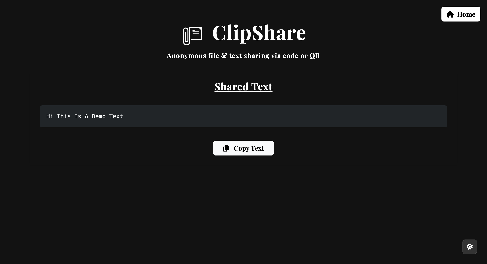
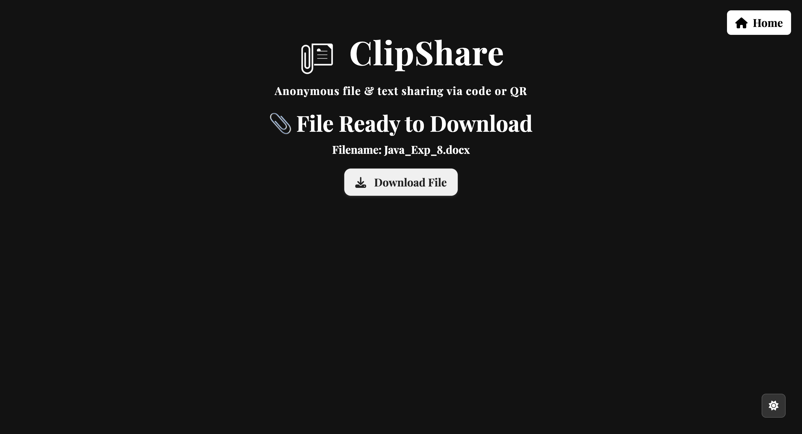

# 📎 ClipShare


**ClipShare** is a minimal, anonymous file and text sharing web application. It generates a unique code and QR for each upload, enabling quick sharing via links or scanning.


---

## ✨ Features

- 🔐 Anonymous file & text sharing
- 🔗 Unique code + QR code for every upload
- 📤 Upload files or paste text
- 📥 Receive using code or QR
- 🌙 Light/Dark theme toggle
- 📋 Copy link or text to clipboard
- 💻 Responsive design with Bootstrap 5

---

## 🚀 How to Run Locally

### 1. Clone the Repository

```bash
git clone https://github.com/darshanpurohit07/ClipShare.git
cd clipshare
```

### 2.Set Up Python Environment
```bash
python3 -m venv venv
source venv/bin/activate  #On Windows: venv\Scripts\activate
pip install -r requirements.txt
```

### 3.Run The Flask App
```bash
python app.py
```
App will be running at: http://127.0.0.1:5001

## 📁 Project Structure

```bash
clipshare/
├── static/
│   ├── css/
│   │   └── style.css
│   ├── images/
│   └── js/
│       └── script.js
├── templates/
│   ├── index.html
│   └── shared_text.html
├── app.py
└── requirements.txt

```

## 📸 Screenshots


### 🔹 Upload Page - Share Link / QR


### 🔹 Receive Page


### 🔹 Received Text


### 🔹 Received File



## 💡 Credits

Created by 💙 [**Darshan Purohit**](https://github.com/darshanpurohit07)

[](https://github.com/darshanpurohit07)


